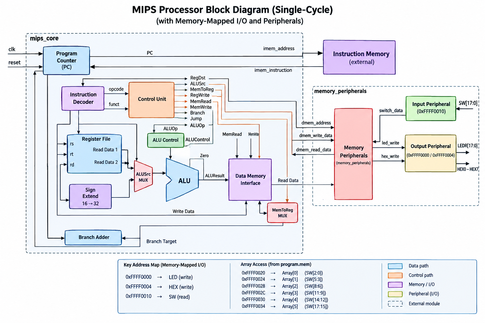

# 32-bit Single-Cycle MIPS Processor on FPGA

A 32-bit single-cycle MIPS processor designed and implemented in **Verilog HDL**, simulated with **ModelSim**, synthesized with **Intel Quartus II**, and deployed on an **Altera DE2 FPGA (Cyclone II)**.

The processor implements a complete MIPS datapath and control system, including instruction fetching, register operations, ALU execution, memory access, branching, jumping, and **memory-mapped FPGA I/O** for switches, LEDs, and seven-segment displays.

---

## 📌 Project Overview

This project implements a **32-bit single-cycle MIPS processor** from the hardware level using Verilog HDL.

Unlike a processor simulation that only operates internally, this implementation was designed to run on a physical **Altera DE2 FPGA**. The processor can execute programs stored in instruction memory and interact with external FPGA peripherals through memory-mapped addresses.

The system consists of:

- A MIPS processor core
- Instruction memory
- Data memory interface
- Memory-mapped I/O
- Switch input peripheral
- LED output peripheral
- Seven-segment display output
- FPGA clock and reset interface

A demonstration program implementing the **Two Sum algorithm** was also developed to demonstrate arithmetic operations, memory access, comparisons, branching, and FPGA I/O.

---

## 🏗️ Architecture

The processor uses a **single-cycle MIPS architecture**, meaning each instruction is fetched, decoded, executed, and completed within one clock cycle.

### Processor Block Diagram



The architecture is divided into the following major sections:

### MIPS Core

The `mips_core` contains the main processor datapath and control logic. It includes:

- Program Counter
- Instruction Decoder
- Control Unit
- Register File
- ALU Control
- ALU
- Sign Extension
- Branch Logic
- Jump Logic
- Data Memory Interface
- Multiplexers
- Branch Adder

### Instruction Memory

Instruction memory is external to the main `mips_core` block. The processor provides an instruction address and receives the instruction in return:

```text
mips_core
    │
    ├── imem_address ──────→ Instruction Memory
    │
    └── imem_instruction ←── Instruction Memory
```

The program instructions are loaded from the project's machine-code memory file.

### Memory and Peripheral Interface

The processor uses a memory/peripheral interface to distinguish between normal data-memory accesses and accesses to FPGA peripherals. This enables MIPS programs to interact with physical hardware using normal load/store instructions.

---

## 🔄 Single-Cycle Datapath

Each instruction follows the general sequence:

```text
Instruction Fetch
        ↓
Instruction Decode
        ↓
Register Read
        ↓
Execute / ALU
        ↓
Memory Access
        ↓
Write Back
```

All operations required for an instruction are completed during a single clock cycle.

---

## 🧩 Processor Components

| Component | Function |
|---|---|
| Program Counter | Stores and updates the address of the current instruction |
| Instruction Decoder | Extracts instruction fields such as opcode and funct |
| Control Unit | Generates the control signals required for instruction execution |
| Register File | Provides 32 general-purpose MIPS registers |
| ALU Control | Determines the specific ALU operation |
| ALU | Performs arithmetic and logical operations |
| Sign Extend | Converts 16-bit immediate values to 32-bit values |
| Branch Adder | Calculates branch target addresses |
| Data Memory Interface | Handles processor data-memory accesses |
| Branch Logic | Determines conditional branch behavior |
| Jump Logic | Handles jump instructions |
| Multiplexers | Select between alternative datapath inputs |
| Memory/Peripheral Interface | Routes memory accesses to memory or FPGA peripherals |

---

## 📖 Instruction Set

The processor implements a subset of the 32-bit MIPS instruction set.

### R-Type Instructions

| Instruction | Description |
|---|---|
| `add` | Addition |
| `sub` | Subtraction |
| `and` | Bitwise AND |
| `or` | Bitwise OR |
| `nor` | Bitwise NOR |
| `slt` | Set on Less Than |

### I-Type Instructions

| Instruction | Description |
|---|---|
| `addi` | Add immediate |
| `lw` | Load word |
| `sw` | Store word |
| `beq` | Branch if equal |
| `lui` | Load upper immediate |
| `ori` | OR immediate |

### J-Type Instructions

| Instruction | Description |
|---|---|
| `j` | Unconditional jump |

These instructions provide the functionality required for arithmetic operations, memory access, conditional execution, loops, and programs such as the Two Sum demonstration.

---

## 🗺️ Memory-Mapped I/O

One of the key features of the processor is its memory-mapped I/O system. Instead of requiring special I/O instructions, FPGA peripherals are assigned specific memory addresses, so MIPS programs can communicate with the hardware using normal load and store operations.

### Address Map

| Address | Peripheral | Operation |
|---|---|---|
| `0xFFFF0000` | LED output | Write |
| `0xFFFF0004` | HEX / seven-segment output | Write |
| `0xFFFF0010` | Switch input | Read |

### Input Peripheral

The DE2 switches are mapped to `0xFFFF0010`. A MIPS program can read the switch state through a normal memory read.

```text
DE2 Switches
      ↓
Input Peripheral
      ↓
0xFFFF0010
      ↓
MIPS Processor
```

### LED Output

The LEDs are mapped to `0xFFFF0000`. A MIPS program can write a value to this address to control the LED output.

```text
MIPS Processor
      ↓
0xFFFF0000
      ↓
LED Peripheral
      ↓
LEDR[17:0]
```

### Seven-Segment Output

The seven-segment displays are mapped to `0xFFFF0004`. A MIPS program can write display data through this address.

```text
MIPS Processor
      ↓
0xFFFF0004
      ↓
HEX Output Peripheral
      ↓
HEX7 – HEX0
```

---

## 🔌 Hardware

**FPGA Development Board:** Altera DE2 Development and Education Board

**Main FPGA:** Altera Cyclone II

**Clock:** 50 MHz

### Inputs

- `SW[17:0]` — 18 board switches
- `KEY[3:0]` — push buttons
- `CLOCK_50` — 50 MHz system clock

### Outputs

- `LEDR[17:0]` — 18 red LEDs
- `HEX7`–`HEX0` — eight seven-segment displays

The processor uses these peripherals to demonstrate interaction between software instructions and physical FPGA hardware.

---

## 💻 Software and Development Tools

| Tool | Purpose |
|---|---|
| Verilog HDL | Hardware description and RTL implementation |
| Intel Quartus II | Synthesis, compilation, FPGA programming |
| ModelSim | HDL simulation and waveform analysis |
| Git | Version control |
| GitHub | Source-code hosting and documentation |

---

## 🧪 Simulation

Before deploying the processor to the FPGA, the design can be simulated using ModelSim.

### 1. Compile the Verilog Files

From ModelSim:

```tcl
vlog *.v
```

If the project contains separate testbench files, compile them as well.

### 2. Start a Testbench

Run the appropriate testbench:

```tcl
vsim work.<testbench_name>
```

For example:

```tcl
vsim work.mips_core_tb
```

### 3. Add Signals to the Waveform

```tcl
add wave *
```

### 4. Run the Simulation

```tcl
run 1000ns
```

The waveform can be used to verify:

- Program Counter updates
- Instruction fetching
- Instruction decoding
- Register reads and writes
- ALU operations
- Memory reads and writes
- Branch and jump operations
- Processor outputs

---

## ⚙️ Compiling with Quartus II

### 1. Open the Quartus Project

Open the project's `.qpf` file in Intel Quartus II.

### 2. Set the Top-Level Entity

The FPGA top-level module is `fpga_top`. Set it through:

**Assignments → Settings → General**, then set:

```text
Top-level entity: fpga_top
```

### 3. Add the Verilog Source Files

The project should include the required processor and FPGA modules:

```text
fpga_top.v
mips_core.v
program_counter.v
instruction_memory.v
register_file.v
alu.v
alu_control.v
control_unit.v
sign_extend.v
data_memory.v
branch_logic.v
jump_logic.v
mux.v
adder.v
```

### 4. Configure FPGA Pin Assignments

Assign the appropriate FPGA pins for the following, using the DE2 board's pin configuration:

- `CLOCK_50`
- `KEY`
- `SW`
- `LEDR`
- `HEX0`–`HEX7`

### 5. Compile

Select **Processing → Start Compilation**. Quartus performs:

```text
Analysis & Synthesis
        ↓
Fitter
        ↓
Assembler
        ↓
Timing Analysis
```

A successful compilation generates the FPGA programming file (`.sof`).

---

## 🚀 Programming the DE2 FPGA

1. **Connect the board** — Connect the Altera DE2 board to the computer using the USB-Blaster connection and power on the board.
2. **Open Quartus Programmer** — Go to **Tools → Programmer**.
3. **Select the hardware** — Select the connected USB-Blaster hardware.
4. **Load the `.sof` file** — Select the generated `.sof` programming file and enable **Program/Configure**.
5. **Program the FPGA** — Click **Start**.

After programming, the FPGA will run the synthesized MIPS processor.

---

## 📂 Program Memory

The processor executes machine-code instructions stored in instruction memory. The program memory file is `program.mem`.

```text
program.mem
     ↓
Instruction Memory
     ↓
Instruction Fetch
     ↓
Instruction Decode
     ↓
MIPS Datapath
     ↓
Instruction Execution
```

Changing the contents of `program.mem` allows a different MIPS program to be executed without changing the processor datapath, provided the program uses the supported instruction set and available I/O interface.

---

## ➕ Two Sum Demonstration

A major demonstration developed for the processor is the **Two Sum** algorithm. The processor searches an array for two values whose sum equals a specified target.

**Example:**

```text
Array:  [2, 7, 11, 15, 3, 6, 8, 10]
Target: 9
```

The processor identifies `2 + 7 = 9`, therefore the result is:

```text
Index 0
Index 1
```

### FPGA Interaction

The demonstration uses the FPGA hardware as part of the computation. The target value can be supplied through the DE2 switches, while the processor accesses the stored array through memory.

The processor performs:

- Input reading
- Memory access
- Arithmetic operations
- Value comparison
- Loop execution
- Conditional branching
- Result generation
- FPGA output

This demonstrates that the MIPS processor itself executes the algorithm, rather than the FPGA simply implementing a dedicated Two Sum circuit.

### Array Memory Mapping

The block diagram defines the following array locations:

| Address | Data |
|---|---|
| `0xFFFF0020` | Array[0] → `SW[2:0]` |
| `0xFFFF0024` | Array[1] → `SW[5:3]` |
| `0xFFFF0028` | Array[2] → `SW[8:6]` |
| `0xFFFF002C` | Array[3] → `SW[11:9]` |
| `0xFFFF0030` | Array[4] → `SW[14:12]` |
| `0xFFFF0034` | Array[5] → `SW[17:15]` |

This provides a direct interface between FPGA switch inputs and the data used by the processor.

---

## 📸 Project Demonstration

### Processor Architecture

The complete processor architecture is shown below:


### FPGA Implementation

The processor was successfully synthesized and deployed on the Altera DE2 FPGA. The physical implementation uses:

- `SW[17:0]` for input
- `LEDR[17:0]` for LED output
- `HEX7`–`HEX0` for seven-segment output
- `CLOCK_50` for the processor clock
- `KEY` push buttons for board control/reset

A video demonstration can be added to this section when available.

---

## 👨‍💻 My Contribution

This was developed as a team project. My contributions included work across processor implementation, testing, FPGA integration, and demonstration. Specifically:

- Contributed to the design and implementation of the 32-bit single-cycle MIPS processor in Verilog HDL
- Worked on integrating the processor datapath and major processor components
- Implemented and tested supported MIPS instructions and control behavior
- Worked on simulation and debugging using ModelSim
- Tested the processor on the Altera DE2 FPGA using Quartus II
- Worked on FPGA input/output integration using switches, LEDs, and seven-segment displays
- Developed and tested the Two Sum demonstration
- Debugged hardware and simulation issues during system integration
- Contributed to project documentation and final testing

<!-- Adjust this contribution list to match the specific modules and tasks you personally handled. -->

---

## 📁 Project Structure

```text
MIPS/
│
├── fpga_top.v
├── mips_core.v
├── program_counter.v
├── instruction_memory.v
├── register_file.v
├── alu.v
├── alu_control.v
├── control_unit.v
├── sign_extend.v
├── data_memory.v
├── branch_logic.v
├── jump_logic.v
├── mux.v
├── adder.v
│
├── program.mem
│
├── testbenches/
│   └── ...
│
├── simulation/
│   └── ...
│
├── images/
│   └── mips-block-diagram.png
│
├── .gitignore
└── README.md
```

---

## 🎯 Learning Outcomes

This project provided practical experience in:

- Computer architecture
- MIPS instruction-set architecture
- Datapath design
- Control-unit design
- RTL design
- Verilog HDL
- Digital logic design
- CPU implementation
- Register-file design
- ALU design
- Memory systems
- Memory-mapped I/O
- HDL simulation
- FPGA synthesis
- FPGA programming
- Hardware debugging
- Machine-code programming
- Hardware/software interaction

---

## 🔮 Future Improvements

Potential extensions to the processor include:

- 5-stage pipelined MIPS architecture
- Hazard detection and forwarding
- UART communication
- Timer peripherals
- Interrupt support
- Additional MIPS instructions
- More sophisticated memory-mapped peripherals
- Cache memory
- Performance comparison between single-cycle and pipelined implementations
- RISC-V processor implementation
- Hardware acceleration for selected algorithms

---

## 👥 Project Team

This project was developed as a team project at:

**Obafemi Awolowo University (OAU)**
Department of Computer Engineering